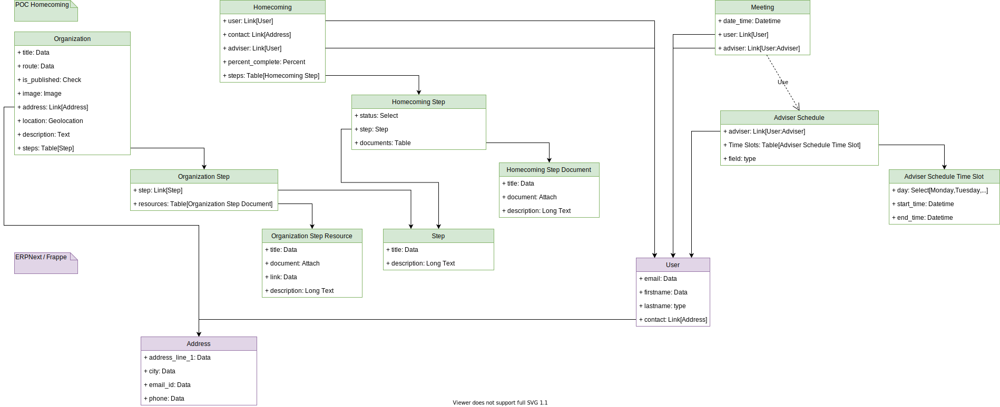

# **erpnext_poc_homecoming** Documentation site

This directory contains the code for the **ERPNext POC Homecoming** docs site, [monogramm.github.io/erpnext_poc_homecoming](https://monogramm.github.io/erpnext_poc_homecoming).

References:

-   [Publish Your Project Documentation with GitHub Pages](https://github.blog/2016-08-22-publish-your-project-documentation-with-github-pages/)

## Architecture

## Contributing

For information about contributing, see the [Contributing page](https://github.com/Monogramm/erpnext_poc_homecoming/blob/master/CONTRIBUTING.md).
