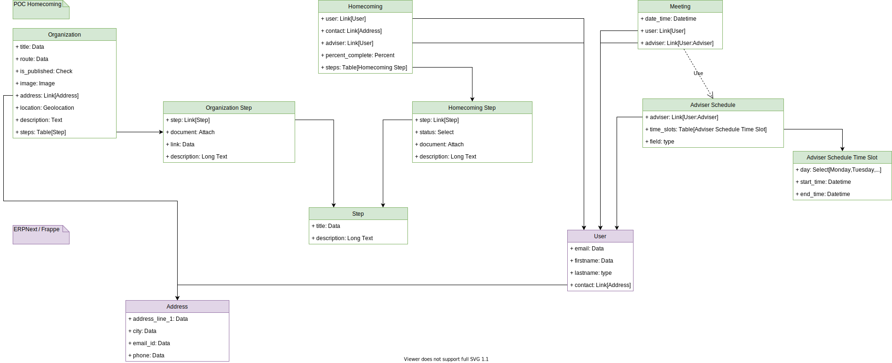

# **erpnext_poc_homecoming** Documentation site

This directory contains the code for the **ERPNext POC Homecoming** docs site, [monogramm.github.io/erpnext_poc_homecoming](https://monogramm.github.io/erpnext_poc_homecoming).

> :warning: :alembic: **This application is just a Proof of Concept and is not ready for production nor complete!**

## (_Target_) Usage

Use this application to create your own 'homecoming' project and get in contact with organizations.

As a backoffice administrator or manager:
1. create Steps with a simple title and description
1. create Organizations and their main information (name, address, geolocation)
1. associate steps managed by an Organization and add Organization's specific documents or links (forms, websites, ...)
1. be notified of any new meetings or homecoming projects progression
1. display meetings in Gantt view or Calendar View

As a guest or customer:
1. Navigate through the list of organizations (`/organizations`) or look for them on a Map (`/map`)
1. Signup to create your own account and enter your contact information
1. Request a meeting with an adviser
1. Manage your homecoming project from the frontoffice

## Architecture

## Contributing

For information about contributing, see the [Contributing page](https://github.com/Monogramm/erpnext_poc_homecoming/blob/master/CONTRIBUTING.md).
